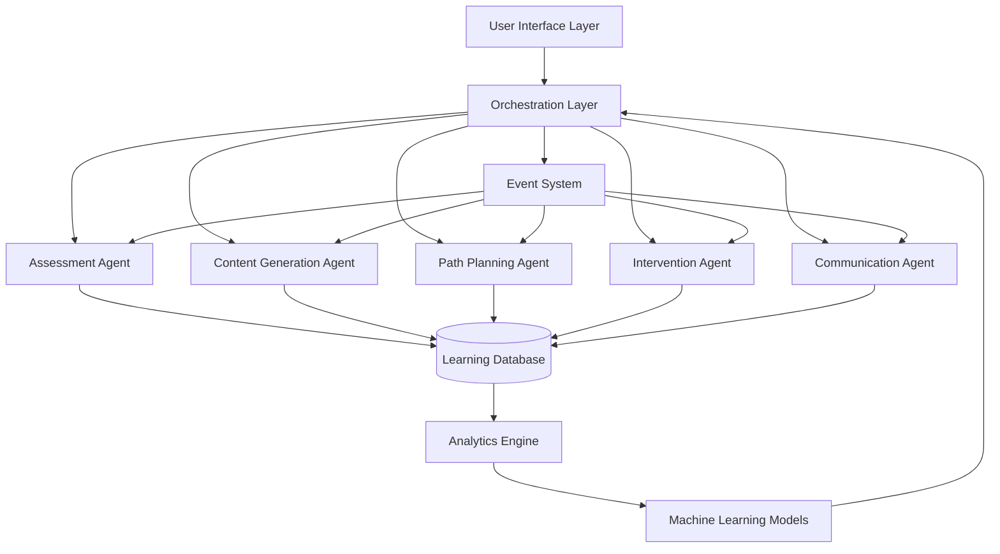

# Design Document

## Overview

The Agentic Learning Engine transforms Sunny from a reactive chatbot into a proactive, intelligent teaching system that operates autonomously to provide personalized education experiences. The engine consists of interconnected components that continuously observe, analyze, plan, and execute learning activities without requiring explicit user prompts.

The system employs a multi-agent architecture where specialized AI agents handle different aspects of the learning process - assessment, content generation, path planning, and intervention - all coordinated by a central orchestration layer that maintains coherent learning experiences.

## Architecture

### High-Level System Architecture



### Core Components

#### 1. Orchestration Layer
- **Purpose**: Central coordinator that manages all agent interactions and maintains learning session coherence
- **Responsibilities**: 
  - Route events between agents
  - Maintain global learning state
  - Ensure smooth transitions between activities
  - Handle conflict resolution between agent recommendations

#### 2. Assessment Agent
- **Purpose**: Continuously evaluates student understanding and learning progress
- **Capabilities**:
  - Real-time conversation analysis using NLP
  - Response time and accuracy tracking
  - Knowledge gap identification
  - Comprehension level assessment
  - Emotional state detection

#### 3. Content Generation Agent
- **Purpose**: Dynamically creates personalized learning materials
- **Capabilities**:
  - Auto-generate quizzes based on learning objectives
  - Create themed lessons incorporating student interests
  - Generate practice exercises targeting specific skills
  - Produce multi-modal content (text, visual, interactive)
  - Align content with curriculum standards

#### 4. Path Planning Agent
- **Purpose**: Designs and adapts personalized learning journeys
- **Capabilities**:
  - Generate learning sequences based on student profiles
  - Dynamically restructure paths based on progress
  - Insert prerequisite concepts when needed
  - Balance multiple learning objectives
  - Optimize for engagement and effectiveness

#### 5. Intervention Agent
- **Purpose**: Proactively provides support and motivation
- **Capabilities**:
  - Detect frustration and engagement drops
  - Provide scaffolding support automatically
  - Adjust difficulty levels in real-time
  - Introduce gamification elements
  - Suggest breaks and alternative activities

#### 6. Communication Agent
- **Purpose**: Manages all student-facing interactions
- **Capabilities**:
  - Adapt communication style to student profile
  - Maintain conversational context and memory
  - Provide smooth transitions between activities
  - Generate age-appropriate explanations
  - Handle multi-turn conversations

## Components and Interfaces

### Agent Communication Protocol

```typescript
interface AgentMessage {
  id: string;
  from: AgentType;
  to: AgentType | 'orchestrator';
  type: MessageType;
  payload: any;
  timestamp: number;
  priority: 'low' | 'medium' | 'high' | 'urgent';
}

interface AgentResponse {
  messageId: string;
  success: boolean;
  data?: any;
  error?: string;
  recommendations?: Recommendation[];
}
```

### Learning State Management

```typescript
interface LearningState {
  studentId: string;
  sessionId: string;
  currentObjectives: LearningObjective[];
  knowledgeMap: ConceptMap;
  engagementMetrics: EngagementData;
  learningPath: PathNode[];
  currentActivity: Activity;
  contextHistory: ContextEntry[];
}

interface ConceptMap {
  concepts: Concept[];
  relationships: ConceptRelationship[];
  masteryLevels: Map<string, MasteryLevel>;
  knowledgeGaps: Gap[];
}
```

### Content Generation Interface

```typescript
interface ContentRequest {
  type: 'quiz' | 'lesson' | 'exercise' | 'game';
  topic: string;
  difficulty: DifficultyLevel;
  learningStyle: LearningStyle[];
  objectives: LearningObjective[];
  constraints: ContentConstraints;
  studentProfile: StudentProfile;
}

interface GeneratedContent {
  id: string;
  type: ContentType;
  content: any;
  metadata: ContentMetadata;
  adaptationHints: AdaptationHint[];
}
```

## Data Models

### Student Profile Model

```typescript
interface EnhancedStudentProfile {
  // Basic Information
  id: string;
  name: string;
  age: number;
  gradeLevel: string;
  
  // Learning Characteristics
  learningStyles: LearningStyleProfile;
  cognitiveProfile: CognitiveProfile;
  motivationFactors: MotivationProfile;
  
  // Performance Data
  knowledgeMap: ConceptMap;
  skillLevels: Map<string, SkillLevel>;
  learningVelocity: LearningVelocityData;
  
  // Behavioral Patterns
  engagementPatterns: EngagementPattern[];
  responsePatterns: ResponsePattern[];
  preferredActivityTypes: ActivityPreference[];
  
  // Historical Data
  sessionHistory: LearningSession[];
  progressTimeline: ProgressEvent[];
  interventionHistory: InterventionEvent[];
}
```

### Learning Analytics Model

```typescript
interface LearningAnalytics {
  studentId: string;
  timeWindow: TimeWindow;
  
  // Performance Metrics
  comprehensionRate: number;
  retentionRate: number;
  transferRate: number;
  
  // Engagement Metrics
  attentionSpan: Duration;
  interactionFrequency: number;
  motivationLevel: number;
  
  // Learning Efficiency
  conceptAcquisitionRate: number;
  errorPatterns: ErrorPattern[];
  optimalDifficultyCurve: DifficultyPoint[];
  
  // Predictive Insights
  riskFactors: RiskFactor[];
  recommendations: AnalyticsRecommendation[];
  nextOptimalActivities: Activity[];
}
```

## Error Handling

### Agent Failure Recovery

```typescript
interface FailureRecoveryStrategy {
  agentType: AgentType;
  failureType: FailureType;
  recoveryActions: RecoveryAction[];
  fallbackBehavior: FallbackBehavior;
  escalationThreshold: number;
}

// Example recovery strategies
const recoveryStrategies: FailureRecoveryStrategy[] = [
  {
    agentType: 'ContentGeneration',
    failureType: 'GenerationTimeout',
    recoveryActions: ['useTemplateContent', 'simplifyRequirements'],
    fallbackBehavior: 'useCachedContent',
    escalationThreshold: 3
  },
  {
    agentType: 'Assessment',
    failureType: 'AnalysisError',
    recoveryActions: ['useBasicAssessment', 'requestManualInput'],
    fallbackBehavior: 'assumeNeutralState',
    escalationThreshold: 2
  }
];
```

### Data Consistency Management

```typescript
interface ConsistencyManager {
  validateLearningState(state: LearningState): ValidationResult;
  reconcileConflictingData(conflicts: DataConflict[]): ReconciliationResult;
  maintainDataIntegrity(operations: DataOperation[]): IntegrityResult;
  handleCorruptedData(corruption: DataCorruption): RecoveryResult;
}
```

## Testing Strategy

### Agent Testing Framework

```typescript
interface AgentTestSuite {
  unitTests: AgentUnitTest[];
  integrationTests: AgentIntegrationTest[];
  behaviorTests: AgentBehaviorTest[];
  performanceTests: AgentPerformanceTest[];
}

interface AgentBehaviorTest {
  name: string;
  scenario: LearningScenario;
  expectedBehaviors: ExpectedBehavior[];
  successCriteria: SuccessCriteria;
  timeoutMs: number;
}
```

### Learning Effectiveness Testing

```typescript
interface LearningEffectivenessTest {
  testName: string;
  studentProfiles: TestStudentProfile[];
  learningObjectives: LearningObjective[];
  duration: Duration;
  successMetrics: EffectivenessMetric[];
  comparisonBaseline: BaselineData;
}
```

### A/B Testing Framework

```typescript
interface ABTestConfiguration {
  testId: string;
  variants: TestVariant[];
  trafficSplit: TrafficSplit;
  successMetrics: Metric[];
  duration: Duration;
  stopConditions: StopCondition[];
}
```

## Performance Considerations

### Real-Time Processing Requirements

- **Response Time Targets**:
  - Agent communication: < 100ms
  - Content generation: < 2 seconds
  - Assessment analysis: < 500ms
  - Path planning: < 1 second

### Scalability Architecture

```typescript
interface ScalabilityStrategy {
  // Horizontal scaling
  agentPooling: AgentPoolConfig;
  loadBalancing: LoadBalancingStrategy;
  
  // Caching strategies
  contentCache: CacheStrategy;
  profileCache: CacheStrategy;
  analyticsCache: CacheStrategy;
  
  // Database optimization
  indexingStrategy: IndexingConfig;
  queryOptimization: QueryOptimizationConfig;
  dataPartitioning: PartitioningStrategy;
}
```

### Memory Management

```typescript
interface MemoryManagement {
  sessionDataRetention: RetentionPolicy;
  cacheEvictionPolicy: EvictionPolicy;
  memoryPooling: PoolingStrategy;
  garbageCollection: GCStrategy;
}
```

## Security and Privacy

### Data Protection

```typescript
interface DataProtectionStrategy {
  encryption: EncryptionConfig;
  anonymization: AnonymizationStrategy;
  accessControl: AccessControlPolicy;
  auditLogging: AuditConfig;
  dataRetention: RetentionPolicy;
}
```

### Child Privacy Compliance

```typescript
interface ChildPrivacyCompliance {
  copaCompliance: COPAConfig;
  gdprCompliance: GDPRConfig;
  dataMinimization: DataMinimizationPolicy;
  parentalConsent: ConsentManagement;
  rightToErasure: ErasurePolicy;
}
```